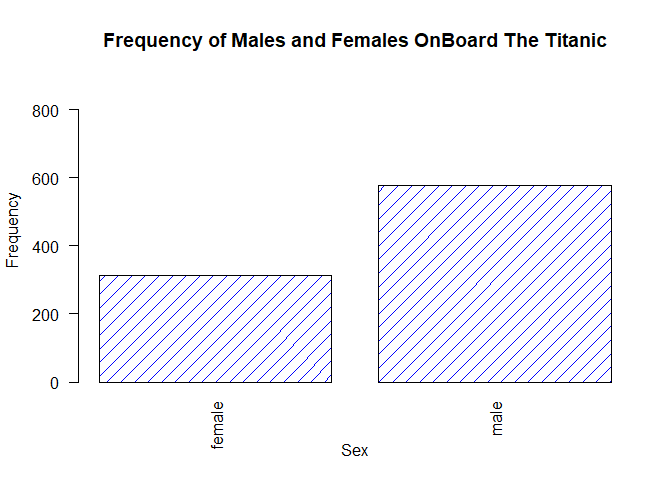
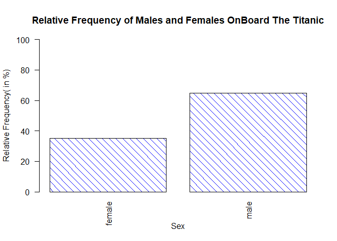

```r
sessionInfo()
```

```
## R version 3.5.0 (2018-04-23)
## Platform: x86_64-w64-mingw32/x64 (64-bit)
## Running under: Windows 10 x64 (build 17134)
## 
## Matrix products: default
## 
## locale:
## [1] LC_COLLATE=English_United States.1252 
## [2] LC_CTYPE=English_United States.1252   
## [3] LC_MONETARY=English_United States.1252
## [4] LC_NUMERIC=C                          
## [5] LC_TIME=English_United States.1252    
## 
## attached base packages:
## [1] stats     graphics  grDevices utils     datasets  methods   base     
## 
## loaded via a namespace (and not attached):
##  [1] compiler_3.5.0  backports_1.1.2 magrittr_1.5    rprojroot_1.3-2
##  [5] tools_3.5.0     htmltools_0.3.6 yaml_2.1.19     Rcpp_0.12.16   
##  [9] stringi_1.1.7   rmarkdown_1.9   knitr_1.20      stringr_1.3.1  
## [13] digest_0.6.15   evaluate_0.10.1
```

# Questions  

\    

#### 1 GitHub Cloning (20 points): Using Git, clone the following GitHub repository to your local machine: https://github.com/caesar0301/awesome-public-datasets.  In RMarkdown, please show the code (commented out, as it's not R syntax) that you used to create a new directory, navigate to the appropriate directory, and clone the repository to it.  Like actual Git, one command per line, please.

\     


chand@LAPTOP-TU9B6NOH MINGW64 ~
$ pwd
/c/Users/chand

chand@LAPTOP-TU9B6NOH MINGW64 ~
$ cd Desktop/MSDS/GitRepos/

chand@LAPTOP-TU9B6NOH MINGW64 ~/Desktop/MSDS/GitRepos
**$ mkdir AwsomePublicDatasets**

chand@LAPTOP-TU9B6NOH MINGW64 ~/Desktop/MSDS/GitRepos
**$ cd  AwsomePublicDatasets/**

chand@LAPTOP-TU9B6NOH MINGW64 ~/Desktop/MSDS/GitRepos/AwsomePublicDatasets
**$ git clone https://github.com/caesar0301/awesome-public-datasets .**    

Cloning into '.'...
remote: Counting objects: 1475, done.
remote: Compressing objects: 100% (18/18), done.
remote: Total 1475 (delta 26), reused 40 (delta 24), pack-reused 1433
Receiving objects: 100% (1475/1475), 556.16 KiB | 2.05 MiB/s, done.
Resolving deltas: 100% (859/859), done.

chand@LAPTOP-TU9B6NOH MINGW64 ~/Desktop/MSDS/GitRepos/AwsomePublicDatasets (master)
$ ls
Datasets/  LICENSE  README.rst

chand@LAPTOP-TU9B6NOH MINGW64 ~/Desktop/MSDS/GitRepos/AwsomePublicDatasets (master)
$ cd Datasets/

chand@LAPTOP-TU9B6NOH MINGW64 ~/Desktop/MSDS/GitRepos/AwsomePublicDatasets/Datasets (master)
$ pwd
/c/Users/chand/Desktop/MSDS/GitRepos/AwsomePublicDatasets/Datasets

chand@LAPTOP-TU9B6NOH MINGW64 ~/Desktop/MSDS/GitRepos/AwsomePublicDatasets/Datasets (master)
$ ls
titanic.csv.zip

chand@LAPTOP-TU9B6NOH MINGW64 ~/Desktop/MSDS/GitRepos/AwsomePublicDatasets/Datasets (master)


\    


#### 2.	Data Summary (20 points): From this aforementioned cloned repo, please extract titanic.csv.zip.  To be clear, this does not have to be done in Git or command line.  

\    

##### a.	In R, please read in titanic.csv via either read.table() or read.csv(), assigning it to df.  This dataset follows the passengers aboard the Titanic, including their fees paid, rooms rented, and survivorship status.

\    


```r
titanicDf <- read.csv("titanic/titanic.csv", header = TRUE)
str(titanicDf)
```

```
## 'data.frame':	891 obs. of  12 variables:
##  $ PassengerId: int  1 2 3 4 5 6 7 8 9 10 ...
##  $ Survived   : int  0 1 1 1 0 0 0 0 1 1 ...
##  $ Pclass     : int  3 1 3 1 3 3 1 3 3 2 ...
##  $ Name       : Factor w/ 891 levels "Abbing, Mr. Anthony",..: 109 191 358 277 16 559 520 629 417 581 ...
##  $ Sex        : Factor w/ 2 levels "female","male": 2 1 1 1 2 2 2 2 1 1 ...
##  $ Age        : num  22 38 26 35 35 NA 54 2 27 14 ...
##  $ SibSp      : int  1 1 0 1 0 0 0 3 0 1 ...
##  $ Parch      : int  0 0 0 0 0 0 0 1 2 0 ...
##  $ Ticket     : Factor w/ 681 levels "110152","110413",..: 524 597 670 50 473 276 86 396 345 133 ...
##  $ Fare       : num  7.25 71.28 7.92 53.1 8.05 ...
##  $ Cabin      : Factor w/ 148 levels "","A10","A14",..: 1 83 1 57 1 1 131 1 1 1 ...
##  $ Embarked   : Factor w/ 4 levels "","C","Q","S": 4 2 4 4 4 3 4 4 4 2 ...
```

\    

##### b.	Output the respective count of females and males aboard the Titanic. Plot the frequency of females and males.  Be sure to give an accurate title and label the axes.
\    

```r
table(titanicDf$Sex)
```

```
## 
## female   male 
##    314    577
```

```r
# Plotting the frequency table
barplot(table(titanicDf$Sex), xlab = "", ylab = "Frequency", main = "Frequency of Males and Females OnBoard The Titanic", ylim = c(0,length(titanicDf$Sex)), horiz=F, las=2, col = 20, density = c(10,10), angle = c(45, 45))
mtext("Sex", side=1, line=3)
```

<!-- -->

Plotting Relative Frequency of Males and Females.


```r
# Plotting the relative frequency table showing % of Males and Females onboard the titanic.
barplot((table(titanicDf$Sex)/length(titanicDf$Sex)) * 100, xlab = "", ylab = "Relative Frequency( in %)", main = "Relative Frequency of Males and Females OnBoard The Titanic", ylim = c(0,100), horiz=F, las=2, col = 20, density = c(10,10), angle = c(-45, -45))
mtext("Sex", side=1, line=3)
```

<!-- -->

\     

##### c.	Please use one apply function (to review: swirl() modules 11, 12) to output the means of Age, Fare, and Survival.  Make sure the output is a real number for all three means.

\     


```r
# Initialize an empty Vector
x <- numeric(3)
# if any columns contain Missing or NA entries then donot include these entries in any statistic calculation.
if((any(is.na(titanicDf$Age))) | any(is.na(titanicDf$Fare)) | any(is.na(titanicDf$Survived))){
  x <- vapply(titanicDf[, c("Age", "Fare", "Survived")], mean, na.rm = TRUE, numeric(1))
} else{
  x <- vapply(titanicDf[, c("Age", "Fare", "Survived")], mean, numeric(1))
}
x
```

```
##        Age       Fare   Survived 
## 29.6991176 32.2042080  0.3838384
```

```r
print(paste("The Mean Age of people onboard the Titanic = ", signif(x["Age"],4), sep=""))
```

```
## [1] "The Mean Age of people onboard the Titanic = 29.7"
```

```r
print(paste("The Mean Fare paid by people onboard the Titanic = ", signif(x["Fare"],4), sep=""))
```

```
## [1] "The Mean Fare paid by people onboard the Titanic = 32.2"
```

```r
print(paste("The Mean Survival Rate of people onboard the Titanic = ", signif(x["Survived"],2), sep=""))
```

```
## [1] "The Mean Survival Rate of people onboard the Titanic = 0.38"
```

\     


#### 3.	Function Building (30 points): You research sleep and just got your first data set.  Later, you'll have another dataset with the same column names, so you want to create a helper function that you can analyze this dataset and the next.  Load sleep_data_01.csv (found at http://talklab.psy.gla.ac.uk/L1_labs/lab_1/homework/index.html).  Questions 3A through 3D should be answered in function(x){}.  3E can be outside of the function.  

\     


```r
# Read the csv formatted data set
sleepDataDf <- read.csv("sleep_data_01.csv", header = TRUE)
str(sleepDataDf)
```

```
## 'data.frame':	101 obs. of  15 variables:
##  $ SubjID  : int  1 2 3 4 5 6 7 8 9 10 ...
##  $ Age     : int  16 16 16 16 16 16 16 13 12 16 ...
##  $ Gender  : int  2 1 1 1 1 1 1 1 1 2 ...
##  $ PSQI    : int  5 4 7 6 8 15 7 4 5 4 ...
##  $ PSAScog : int  8 31 9 17 33 NA 27 13 14 11 ...
##  $ FOMO    : int  18 41 16 22 36 NA 15 17 25 16 ...
##  $ SMUISa  : int  19 25 17 14 NA NA 20 9 15 7 ...
##  $ SM1     : int  11 18 16 17 NA NA 21 17 17 13 ...
##  $ SM2     : int  12 21 14 13 NA NA 24 2 7 11 ...
##  $ HADSa   : int  10 20 7 9 NA NA 13 9 10 4 ...
##  $ HADSd   : int  8 8 3 5 NA NA 6 7 5 2 ...
##  $ RSES    : int  17 5 17 12 NA NA 22 22 21 21 ...
##  $ Bedtime : num  10 10 10.5 10.5 11 ...
##  $ Latency : int  20 30 20 30 30 20 15 5 30 20 ...
##  $ Duration: num  10 9 7.5 7 6 4 6 11 8.5 8 ...
```

\   

##### a.	Create objects for the median Age, the minimum and maximum Duration of sleep, and the mean and standard deviation of the Rosenberg Self Esteem scale (RSES).  You may need to specify a few options like in Problem 2 and live session. 

##### b.	Create a data.frame object called report: it should consist of the median age, the RSES mean and standard deviation respectively divided by five (since there are five questions and these scores are summed), and the range of Duration (the statistical definition of range; it should be a single number.)

##### c.	Change the column names of this data.frame to MedianAge, SelfEsteem, SE_SD, and DurationRange.

##### d.	Round the report to at most 2 digits: leave this as the closing line to the function.

\    

```r
############################################################
# Function Name: createReportFromDf
# Description: Function to create a summary in known format
#              from desired columns of a defined data frame.
# Input: DataFrame or sub Data Frame from Sleep Data
# Output: NULL, If Incorrect DataSet is passed
#         A Summary Report Vector containing Median Age, 
#         Average Self Esteem score,
#         Avg Standard Dev of Self Esteem score and
#         Range of Duration of Sleep
#############################################################

createReportFromDf <- function(inputDF){
  
  # Stop the Execution if incorrect Data Frame is passed.
  if(!all(c("Age","Duration","RSES") %in% colnames(inputDF))){
    print("Invalid Input ! Reqd Columns are Missing in Input Data Frame. Returning NULL !")
    return()
  }
  # Part "a" for Ques 3.
  medianAge <- median(inputDF$Age, na.rm = TRUE)
  minDurationOfSleep <- min(inputDF$Duration, na.rm = TRUE)
  maxDurationOfSleep <- max(inputDF$Duration, na.rm = TRUE)
  meanRSES <- mean(inputDF$RSES, na.rm = TRUE)
  sdRSES <- sd(inputDF$RSES, na.rm = TRUE)
  
  # Part "b" for Ques 3
  report <- data.frame(medianAge, meanRSES/5, sdRSES/5, (maxDurationOfSleep - minDurationOfSleep))
  # Part "c" for Ques 3
  colnames(report) <- c("MedianAge", "SelfEsteem", "SE_SD", "DurationRange")
  # Part "d" for Ques 3
  sapply(report, signif, 2)
}
```
\    

##### e.	Finally, run the function on your sleep data to show the output.
\    

```r
# Calling fn with correct DataSet
createReportFromDf(sleepDataDf)
```

```
##     MedianAge    SelfEsteem         SE_SD DurationRange 
##          14.0           3.6           1.2           7.0
```

```r
# Only To Test: Calling fn with Incorrect DataSet, NULL would be returned
createReportFromDf(titanicDf)
```

```
## [1] "Invalid Input ! Reqd Columns are Missing in Input Data Frame. Returning NULL !"
```

```
## NULL
```
