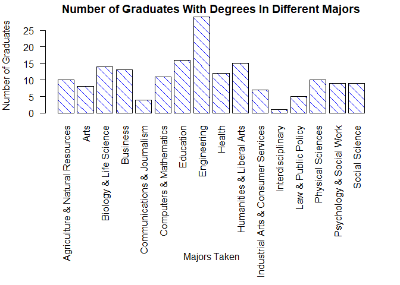
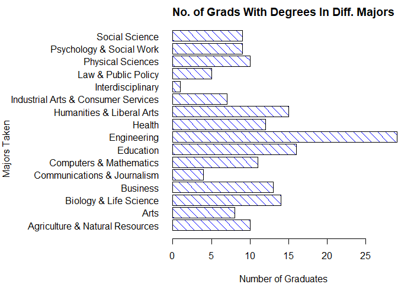

# Questions

\    

#### 1. FiveThirtyEight Data (30 points): Navigate on GitHub to https://github.com/rudeboybert/fivethirtyeight and read README.md. Seriously, it will include everything you need.

\    

##### a. Install the fivethirtyeight package.

\     


```r
options(repos=c(CRAN="fivethirtyeight"))
library(fivethirtyeight)
if(!require(fivethirtyeight))
  stop("Missing Package fivethirtyeight")
sessionInfo()
```

```
## R version 3.5.0 (2018-04-23)
## Platform: x86_64-w64-mingw32/x64 (64-bit)
## Running under: Windows 10 x64 (build 17134)
## 
## Matrix products: default
## 
## locale:
## [1] LC_COLLATE=English_United States.1252 
## [2] LC_CTYPE=English_United States.1252   
## [3] LC_MONETARY=English_United States.1252
## [4] LC_NUMERIC=C                          
## [5] LC_TIME=English_United States.1252    
## 
## attached base packages:
## [1] stats     graphics  grDevices utils     datasets  methods   base     
## 
## other attached packages:
## [1] fivethirtyeight_0.4.0
## 
## loaded via a namespace (and not attached):
##  [1] compiler_3.5.0  backports_1.1.2 magrittr_1.5    rprojroot_1.3-2
##  [5] tools_3.5.0     htmltools_0.3.6 yaml_2.1.19     Rcpp_0.12.16   
##  [9] stringi_1.1.7   rmarkdown_1.9   knitr_1.20      stringr_1.3.1  
## [13] digest_0.6.15   evaluate_0.10.1
```

\    

##### b.	In the listing of Data sets in package 'fivethirtyeight,' assign the eighteenth data set to an object 'df.'

\     

Note: Since the Eighteenth dataset is not what is desired, I have modified the code to first find the index of desired "college_all_ages" dataset and then load the dataset using Index at which it is found. This has been done to come as close to initial intent of the question, although the simplest way would be to load dataset using its name directly.
\   


```r
# Print the list of datasets in the package
data(package = "fivethirtyeight")
# Find the Index for  "college_all_ages" data set.
df_Index <- which(as.list(data(package = "fivethirtyeight"))$results[,"Item"] == "college_all_ages")
# Now Assigning the  dataset at desired index( eighteenth or whatever index) from the list to df object.
df <- get(as.list(data(package = "fivethirtyeight"))$results[df_Index, "Item"], asNamespace("fivethirtyeight"))
str(df)
```

```
## Classes 'tbl_df', 'tbl' and 'data.frame':	173 obs. of  11 variables:
##  $ major_code                 : int  1100 1101 1102 1103 1104 1105 1106 1199 1301 1302 ...
##  $ major                      : chr  "General Agriculture" "Agriculture Production And Management" "Agricultural Economics" "Animal Sciences" ...
##  $ major_category             : chr  "Agriculture & Natural Resources" "Agriculture & Natural Resources" "Agriculture & Natural Resources" "Agriculture & Natural Resources" ...
##  $ total                      : int  128148 95326 33955 103549 24280 79409 6586 8549 106106 69447 ...
##  $ employed                   : int  90245 76865 26321 81177 17281 63043 4926 6392 87602 48228 ...
##  $ employed_fulltime_yearround: int  74078 64240 22810 64937 12722 51077 4042 5074 65238 39613 ...
##  $ unemployed                 : int  2423 2266 821 3619 894 2070 264 261 4736 2144 ...
##  $ unemployment_rate          : num  0.0261 0.0286 0.0302 0.0427 0.0492 ...
##  $ p25th                      : num  34000 36000 40000 30000 38500 35000 39400 35000 38000 40500 ...
##  $ median                     : num  50000 54000 63000 46000 62000 50000 63000 52000 52000 58000 ...
##  $ p75th                      : num  80000 80000 98000 72000 90000 75000 88000 75000 75000 80000 ...
```

```r
dim(df)
```

```
## [1] 173  11
```

\    

##### c.	Use a more detailed list of the data sets to write out the URL in a comment to the related news story.

\     


```r
vignette("fivethirtyeight", package = "fivethirtyeight")
```

```
## starting httpd help server ... done
```

```r
# As found from detailed listing, URL for the Story for data set college_all_ages is :  
# http://fivethirtyeight.com/features/the-economic-guide-to-picking-a-college-major/
```

\    

[Click Here To Follow the Link to Story for college_all_ages DataSet](http://fivethirtyeight.com/features/the-economic-guide-to-picking-a-college-major/)

\    

##### d.	Using R command(s), give the dimensions and column names of this data frame.

\     


```r
# Printing the Dimensions of the Dataset.
dim(df)
```

```
## [1] 173  11
```

```r
# Printing Column Names for the DataSet.
colnames(df)
```

```
##  [1] "major_code"                  "major"                      
##  [3] "major_category"              "total"                      
##  [5] "employed"                    "employed_fulltime_yearround"
##  [7] "unemployed"                  "unemployment_rate"          
##  [9] "p25th"                       "median"                     
## [11] "p75th"
```

\     

#### 2.	Data Summary (30 points): Use your newly assigned data frame for Question 2.  

\    

##### a.	Write an R command that gives you the column names of the data frame.  Right after that, write one that counts the number of columns but not rows.  Hint: The number should match one of your numbers in Question 1d for dimensions.

\    


```r
# Printing Column Names for the DataSet.
colnames(df)
```

```
##  [1] "major_code"                  "major"                      
##  [3] "major_category"              "total"                      
##  [5] "employed"                    "employed_fulltime_yearround"
##  [7] "unemployed"                  "unemployment_rate"          
##  [9] "p25th"                       "median"                     
## [11] "p75th"
```

```r
# Printing Number of Columns
length(colnames(df))
```

```
## [1] 11
```

\    

##### b.	Generate a count of each unique major_category in the data frame.  I recommend using libraries to help.  I have demonstrated one briefly in live-session.  To be clear, this should look like a matrix or data frame containing the major_category and the frequency it occurs in the dataset.  Assign it to major_count.

\    

```r
major_count <- table(df$major_category)
as.data.frame(major_count)
```

```
##                                   Var1 Freq
## 1      Agriculture & Natural Resources   10
## 2                                 Arts    8
## 3               Biology & Life Science   14
## 4                             Business   13
## 5          Communications & Journalism    4
## 6              Computers & Mathematics   11
## 7                            Education   16
## 8                          Engineering   29
## 9                               Health   12
## 10           Humanities & Liberal Arts   15
## 11 Industrial Arts & Consumer Services    7
## 12                   Interdisciplinary    1
## 13                 Law & Public Policy    5
## 14                   Physical Sciences   10
## 15            Psychology & Social Work    9
## 16                      Social Science    9
```

\    

##### c.	To make things easier to read, put par(las=2) before your plot to make the text perpendicular to the axis.  Make a barplot of major_count.  Make sure to label the title with something informative (check the vignette if you need), label the x and y axis, and make it any color other than grey.  Assign the major_category labels to their respective bar.  Flip the barplot horizontally so that bars extend to the right, not upward.  All of these options can be done in a single pass of barplot(). Note: It's okay if it's wider than the preview pane.

\     


```r
# Included par(las=2) in barplot option
op <- par(mar=c(15,4,1.5,2))
barplot(major_count, xlab = "", ylab = "Number of Graduates", main = "Number of Graduates With Degrees In Different Majors", horiz=F, las=2, col = 20, density = c(10,10), angle = c(-45, -45))
mtext("Majors Taken", side=1, line=12)
```

<!-- -->

```r
rm(op)
```

\     

**Flipping The Plot Horizontally**

\    


```r
op <- par(mar=c(4,15,2,0.1))
barplot(major_count, xlab = "Number of Graduates", ylab = "", horiz = T, las=1, col = 20, density = c(10,10), angle = c(-45, -45))
title(main = "No. of Grads With Degrees In Diff. Majors")
mtext("Majors Taken", side=2, line = 14, at = 8)
```

<!-- -->

```r
rm(op)
```

\     


##### d.	Write the fivethirtyeight data to a csv file.  Make sure that it does not have row labels.

\    

```r
getwd()
```

```
## [1] "C:/Users/chand/Desktop/MSDS/GitRepos/SMU_MSDS_HomeWork/MSDS 6306_Doing_Data_Science/Week4/Analysis"
```

```r
write.csv2(df, file = "Data/fivethirtyeight_College_DataSet.csv", row.names = F)
```
\     


#### 3.		Codebook (30 points):  

\     

##### a.	Start a new repository on GitHub for your SMU MSDS homework.  On your local device, make sure there is a directory for Homework at the minimum; you are welcome to add whatever you would like to this repo in addition to your requirements here.
\  

Done. Link to Repo is placed at the end of this complete question.

\  

##### b.	Create a README.md file which explains the purpose of the repository, the topics included, the sources for the material you post, and contact information in case of questions. Remember, the one in the root directory should be general.  You are welcome to make short READMEs for each assignment individually in other folders.

\         
Done. Link to Repo is placed at the end of this complete question.

\     

##### c.	In one (or more) of the nested directories, post your RMarkdown script, HTML file, and data from 'fivethirtyeight.'  Make sure that in your README or elsewhere that you credit fivethirtyeight in some way.

\      

Done. Link to Repo is placed at the end of this complete question.

\     

##### d.	In your RMarkdown script, please provide the link to this GitHub so the grader can see it.

\        

[Click Here To Follow the Link to My SMU HomeWork Repo](https://github.com/R-Chandna/SMU_MSDS_HomeWork)

\    


