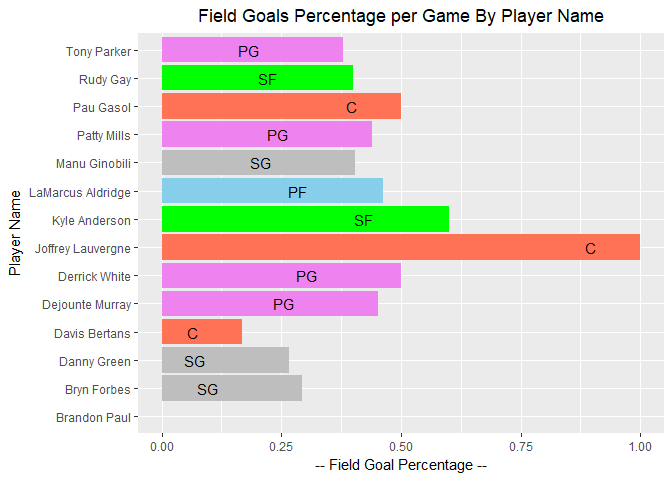

```r
library(dplyr)
```

```
## 
## Attaching package: 'dplyr'
```

```
## The following objects are masked from 'package:stats':
## 
##     filter, lag
```

```
## The following objects are masked from 'package:base':
## 
##     intersect, setdiff, setequal, union
```

```r
library(xml2)
```

```
## Warning: package 'xml2' was built under R version 3.5.1
```

```r
library(rvest)
```

```
## Warning: package 'rvest' was built under R version 3.5.1
```

```r
library(knitr)
library(kableExtra)
```

```
## Warning: package 'kableExtra' was built under R version 3.5.1
```

```r
library(tidyr)
library(ggplot2)
sessionInfo()
```

```
## R version 3.5.0 (2018-04-23)
## Platform: x86_64-w64-mingw32/x64 (64-bit)
## Running under: Windows 10 x64 (build 17134)
## 
## Matrix products: default
## 
## locale:
## [1] LC_COLLATE=English_United States.1252 
## [2] LC_CTYPE=English_United States.1252   
## [3] LC_MONETARY=English_United States.1252
## [4] LC_NUMERIC=C                          
## [5] LC_TIME=English_United States.1252    
## 
## attached base packages:
## [1] stats     graphics  grDevices utils     datasets  methods   base     
## 
## other attached packages:
## [1] ggplot2_2.2.1    tidyr_0.8.0      kableExtra_0.9.0 knitr_1.20      
## [5] rvest_0.3.2      xml2_1.2.0       dplyr_0.7.4     
## 
## loaded via a namespace (and not attached):
##  [1] Rcpp_0.12.16      rstudioapi_0.7    bindr_0.1.1      
##  [4] magrittr_1.5      hms_0.4.2         munsell_0.4.3    
##  [7] viridisLite_0.3.0 colorspace_1.3-2  R6_2.2.2         
## [10] rlang_0.2.0       plyr_1.8.4        stringr_1.3.1    
## [13] httr_1.3.1        tools_3.5.0       grid_3.5.0       
## [16] gtable_0.2.0      htmltools_0.3.6   lazyeval_0.2.1   
## [19] yaml_2.1.19       assertthat_0.2.0  rprojroot_1.3-2  
## [22] digest_0.6.15     tibble_1.4.2      bindrcpp_0.2.2   
## [25] purrr_0.2.4       readr_1.1.1       glue_1.2.0       
## [28] evaluate_0.10.1   rmarkdown_1.9     stringi_1.1.7    
## [31] compiler_3.5.0    pillar_1.2.2      scales_0.5.0     
## [34] backports_1.1.2   pkgconfig_2.0.1
```

# Questions  

\    

#### 1.	Harry Potter Cast (50%) 

\     

\    

##### a.	In the IMDB, there are listings of full cast members for movies.  Navigate to http://www.imdb.com/title/tt1201607/fullcredits?ref_=tt_ql_1.  Feel free to View Source to get a good idea of what the page looks like in code. 
\ 


```r
ImdbUrl <- "http://www.imdb.com/title/tt1201607/fullcredits?ref_=tt_ql_1"
```

\     

##### b.	Scrape the page with any R package that makes things easy for you.  Of particular interest is the table of the Cast in order of crediting.  Please scrape this table (you might have to fish it out of several of the tables from the page) and make it a data.frame() of the Cast in your R environment 
\  


```r
RawHTMLDoc <- read_html(ImdbUrl)
# Find the table with class attribute as cast list
xPathToCastTable <- '//table[@class="cast_list"]'
CastTableNode <- html_nodes(RawHTMLDoc, xpath = xPathToCastTable)
CastTblDF <- as.data.frame(html_table(CastTableNode, trim=T)) 
```

\    

##### c.	Clean up the table 
  * It should not have blank observations or rows, a row that should be column names, or just '.' 
  * It should have intuitive column names (ideally 2 to start - Actor and Character) 
  * In the film, Mr. Warwick plays two characters, which makes his row look a little weird.  Please replace his character column with just "Griphook / Professor Filius Flitwick" to make it look better. 
  * One row might result in "Rest of cast listed alphabetically" - remove this observation. 
\  


```r
# Select only 2 valid colmns
CastTblDF <-  CastTblDF %>% select(X2, X4)
# Give logical Names to columns
colnames(CastTblDF) <- c("Actor", "Character")
# Remove pattern \n  from Character colmn
CastTblDF$Character <- gsub("[\n]+  ", "", CastTblDF$Character)
# Remove Empty Rows
CastTblDF <- subset(CastTblDF, !Actor == "")
# Cleaning Specific observations
CastTblDF[CastTblDF$Actor == "Warwick Davis", "Character"] <- "Griphook / Professor Filius Flitwick"
CastTblDF <- subset(CastTblDF, !Actor == "Rest of cast listed alphabetically:")
```

\  

##### d.	Split the Actor's name into two columns: FirstName and Surname.  Keep in mind that some actors/actresses have middle names as well.  Please make sure that the middle names are in the FirstName column, in addition to the first name (example: given the Actor Frank Jeffrey Stevenson, the FirstName column would say "Frank Jeffrey.")
\   

```r
# Splitting the col Actor into First and Last name based upon presense of last white space
# If name given as X Y Z, then First Name = X Y and Surname = z
CastTblDF <- separate(CastTblDF, "Actor", into = c("First Name", "Surname"), sep = ' (?=[^ ]+$)')
# Fixing the row names after deletions
row.names(CastTblDF) <- 1:nrow(CastTblDF)
print("Sample Output AFter Name Split")
```

```
## [1] "Sample Output AFter Name Split"
```

```r
CastTblDF[c(1,5,12), ]
```

```
##       First Name Surname           Character
## 1          Ralph Fiennes      Lord Voldemort
## 5         Rupert   Grint         Ron Weasley
## 12 Helena Bonham  Carter Bellatrix Lestrange
```

\  

##### e.	Present the first 10 rows of the data.frame() - It should have only FirstName, Surname, and Character columns. 
\   
\   

```r
head(CastTblDF, 10)
```

```
##    First Name   Surname                            Character
## 1       Ralph   Fiennes                       Lord Voldemort
## 2     Michael    Gambon           Professor Albus Dumbledore
## 3        Alan   Rickman              Professor Severus Snape
## 4      Daniel Radcliffe                         Harry Potter
## 5      Rupert     Grint                          Ron Weasley
## 6        Emma    Watson                     Hermione Granger
## 7      Evanna     Lynch                        Luna Lovegood
## 8    Domhnall   Gleeson                         Bill Weasley
## 9    Clémence     Poésy                       Fleur Delacour
## 10    Warwick     Davis Griphook / Professor Filius Flitwick
```
\ 

\    

#### 2.	SportsBall (50%)

\   

\  

##### a.	On the ESPN website, there are statistics of each NBA player.  Navigate to the San Antonio Spurs current statistics (likely http://www.espn.com/nba/team/stats/_/name/sa/san-antonio-spurs).  You are interested in the Shooting Statistics table.  

\  
\ 


```r
EspnUrl <- "http://www.espn.com/nba/team/stats/_/name/sa/san-antonio-spurs"
```
\ 

\   

##### b.	Scrape the page with any R package that makes things easy for you.  There are a few tables on the page, so make sure you are targeting specifically the Shooting Statistics table. 
\ 

```r
RawESPNHTMLDoc <- read_html(EspnUrl)
AllTables <- html_nodes(RawESPNHTMLDoc,"table")
# Shooting Stats table is at index 2
ShootingStatsDF <- as.data.frame(html_table(AllTables[2], trim=T, header = T))
```

\    

##### c.	Clean up the table (You might get some warnings if you're working with tibbles)
* You'll want to create an R data.frame() with one observation for each player.  Make sure that you do not accidentally include blank rows, a row of column names, or the Totals row in the table as observations. 
* The column PLAYER has two variables of interest in it: the player's name and their position, denoted by 1-2 letters after their name.  Split the cells into two columns, one with Name and the other Position. 
* Check the data type of all columns.  Convert relevant columns to numeric.  Check the data type of all columns again to confirm that they have changed!

\  


```r
# Making the first row aas column names
names(ShootingStatsDF) <- as.matrix(ShootingStatsDF[1, ])
ShootingStatsDF <- ShootingStatsDF[-1, ]
ShootingStatsDF[] <- lapply(ShootingStatsDF, function(x){type.convert(as.character(x))})
# Removing the Totals Row
ShootingStatsDF <- subset(ShootingStatsDF, !PLAYER == "Totals")
# Splitting the PLAYER col
ShootingStatsDF <- separate(ShootingStatsDF, "PLAYER", into = c("Name", "Position"), sep = ',')
# Removing leading white Space from the Position Col
ShootingStatsDF$Position <- trimws(ShootingStatsDF$Position, "left")
# Correcting Row Names
row.names(ShootingStatsDF) <- 1:nrow(ShootingStatsDF)
# Checking data type of columns
print("Data Type of all columns is as( what it should be) .. ")
```

```
## [1] "Data Type of all columns is as( what it should be) .. "
```

```r
sapply(ShootingStatsDF, class)
```

```
##        Name    Position         FGM         FGA         FG%         3PM 
## "character" "character"   "numeric"   "numeric"   "numeric"   "numeric" 
##         3PA         3P%         FTM         FTA         FT%         2PM 
##   "numeric"   "numeric"   "numeric"   "numeric"   "numeric"   "numeric" 
##         2PA         2P%         PPS        AFG% 
##   "numeric"   "numeric"   "numeric"   "numeric"
```

```r
# Doing Str for recheck
str(ShootingStatsDF)
```

```
## 'data.frame':	14 obs. of  16 variables:
##  $ Name    : chr  "LaMarcus Aldridge" "Patty Mills" "Rudy Gay" "Manu Ginobili" ...
##  $ Position: chr  "PF" "PG" "SF" "SG" ...
##  $ FGM     : num  7.4 5 5.2 3 2.8 2.8 2 2.4 1.3 1.6 ...
##  $ FGA     : num  16 11.4 13 7.4 6.2 7.4 4 4 4.3 6 ...
##  $ FG%     : num  0.463 0.439 0.4 0.405 0.452 0.378 0.5 0.6 0.294 0.267 ...
##  $ 3PM     : num  0.6 2.6 0.8 1.2 0.8 0 0.2 0 0.5 1 ...
##  $ 3PA     : num  1 7 3.6 3.6 1.2 1 0.6 0.8 2.3 4 ...
##  $ 3P%     : num  0.6 0.371 0.222 0.333 0.667 0 0.333 0 0.222 0.25 ...
##  $ FTM     : num  8.2 0.8 1 1.8 1.4 1 1.8 0.6 1.3 0 ...
##  $ FTA     : num  8.4 1 1.8 2.2 1.8 1.4 2 0.8 1.8 0 ...
##  $ FT%     : num  0.98 0.8 0.56 0.82 0.78 0.71 0.9 0.75 0.71 0 ...
##  $ 2PM     : num  6.8 2.4 4.4 1.8 2 2.8 1.8 2.4 0.8 0.6 ...
##  $ 2PA     : num  15 4.4 9.4 3.8 5 6.4 3.4 3.2 2 2 ...
##  $ 2P%     : num  0.453 0.545 0.468 0.474 0.4 0.438 0.529 0.75 0.375 0.3 ...
##  $ PPS     : num  1.475 1.175 0.938 1.216 1.258 ...
##  $ AFG%    : num  0.48 0.55 0.43 0.49 0.52 0.38 0.53 0.6 0.35 0.35 ...
```

\    

##### d.	Create a colorful bar chart that shows the Field Goals Percentage Per Game for each person. It will be graded on the following criteria. 
* Informative Title, centered 
* Relevant x and y axis labels (not simply variables names!)  
* Human-readable axes with no overlap (you might have to flip x and y to fix that).  Note: You do not have to convert the decimal to a percentage.
* Color the columns by the team member's position (so, all PF's should have the same color, etc.) 
\   


```r
ggplot(ShootingStatsDF, aes(Name, `FG%`, fill=factor(ShootingStatsDF$Position))) +
  geom_bar(stat='identity') + coord_flip() +
  geom_text(aes(label=ShootingStatsDF$Position), color="Black", hjust=5) +
  scale_fill_manual(breaks=levels(ShootingStatsDF$Position), values=c('coral1', 'skyblue', 'violet', 'green', 'grey')) +
  ggtitle("Field Goals Percentage per Game By Player Name") +
  labs(y = "-- Field Goal Percentage --") + labs(x="Player Name") + theme(plot.title = element_text(hjust = 0.5))
```

<!-- -->
